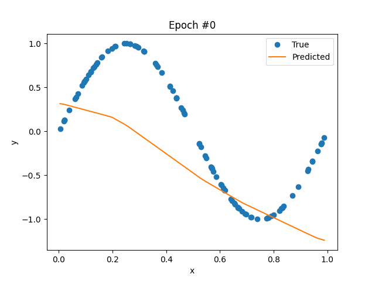
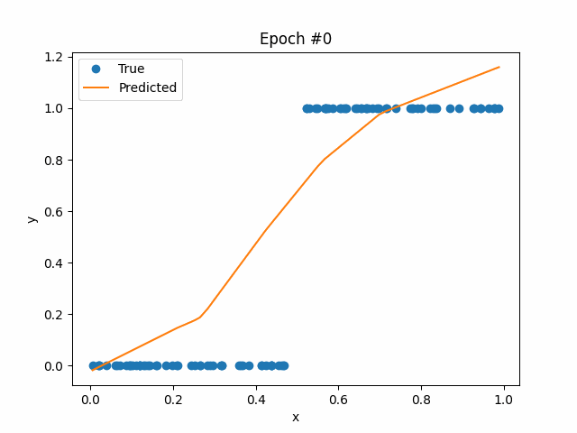

# km-net

Hello! This repository stores code that I wrote in order to better learn how backpropagation works. It was coded from scratch, and only requires numpy.

# Examples of Network Learning

### Sine Function

### Indicator Function

